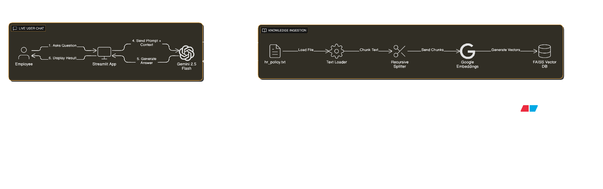

# 🧞 HR Policy Genie - AI Agent

[](https://hr-agent1.streamlit.app)

**A professional RAG-based AI Agent that automates HR support by answering policy queries with 100% accuracy and source verification.**

🔗 **Live Demo:** [Click here to try the App](https://hr-agent1.streamlit.app)

---

## 🚀 Overview
The **HR Policy Genie** solves the problem of employees wasting time searching through 50+ page PDF handbooks. It uses **Retrieval-Augmented Generation (RAG)** to instantly fetch rules about leaves, remote work, and expenses.

Unlike standard chatbots, this agent provides **Source Citations** for trust and offers a **Dynamic UI** to tailor answers for different user needs.

## ✨ Key Features (The "Wow" Factors)
* **⚡ Quick Action Dashboard:** One-click buttons for high-frequency queries (Sick Leave, WFH Rules) – no typing needed!
* **🎛️ Dynamic Response Style:** Users can toggle between **"Concise"** (Executive Summary) and **"Detailed"** (Full Explanation) modes.
* **🔎 Verified Sources:** Every answer comes with an expandable "Source Verification" box, showing the exact text chunks used from the policy file.
* **🛡️ Zero Hallucinations:** Engineered to admit ignorance ("I cannot find that in the policy") rather than inventing answers.

## 🛠️ Architecture


**The Flow:**
1.  **Ingestion:** The `hr_policy.txt` is chunked and embedded using **Google Embeddings (text-embedding-004)**.
2.  **Storage:** Vectors are stored locally using **FAISS** (CPU-optimized).
3.  **Retrieval:** User queries trigger a similarity search in FAISS.
4.  **Generation:** Relevant context + User Query is sent to **Gemini 2.5 Flash**.
5.  **UI:** Streamlit renders the answer + source citations.

## 💻 Tech Stack
* **Frontend:** Streamlit (Custom CSS & Session State)
* **LLM:** Google Gemini 2.5 Flash
* **Orchestration:** LangChain
* **Vector DB:** FAISS
* **Language:** Python 3.11

## ⚙️ Setup & Installation
1.  **Clone the Repo:**
    ```bash
    git clone [https://github.com/Nishmith12/HR-Agent-Challenge.git](https://github.com/Nishmith12/HR-Agent-Challenge.git)
    cd HR-Agent-Challenge
    ```

2.  **Install Dependencies:**
    ```bash
    pip install -r requirements.txt
    ```

3.  **Configure API Key:**
    * Create a `.streamlit/secrets.toml` file (for local) OR set environment variable.
    * `GOOGLE_API_KEY = "your_api_key_here"`

4.  **Run the App:**
    ```bash
    streamlit run app.py
    ```

---
*Submitted for the AI Agent Development Challenge.*